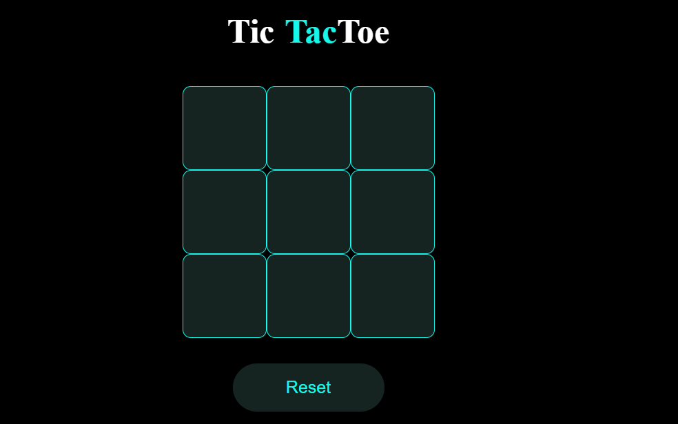

# 🎮 Tic Tac Toe Game - React JS

A simple and interactive Tic Tac Toe game built using **React JS**. Play against a friend and enjoy the classic Xs and Os on your browser!

## 🛠️ Features

- 🧠 Two-player mode (local)
- ✅ Win/draw detection
- 🔄 Game reset functionality
- ⚛️ Built with React functional components and hooks
- 💅 Clean, responsive UI

## 📸 Screenshots



## 🚀 Getting Started

These instructions will help you set up the project on your local machine.

### 1. Clone the repository

```bash
git clone https://github.com/your-username/tic-tac-toe.git
cd tic-tac-toe
